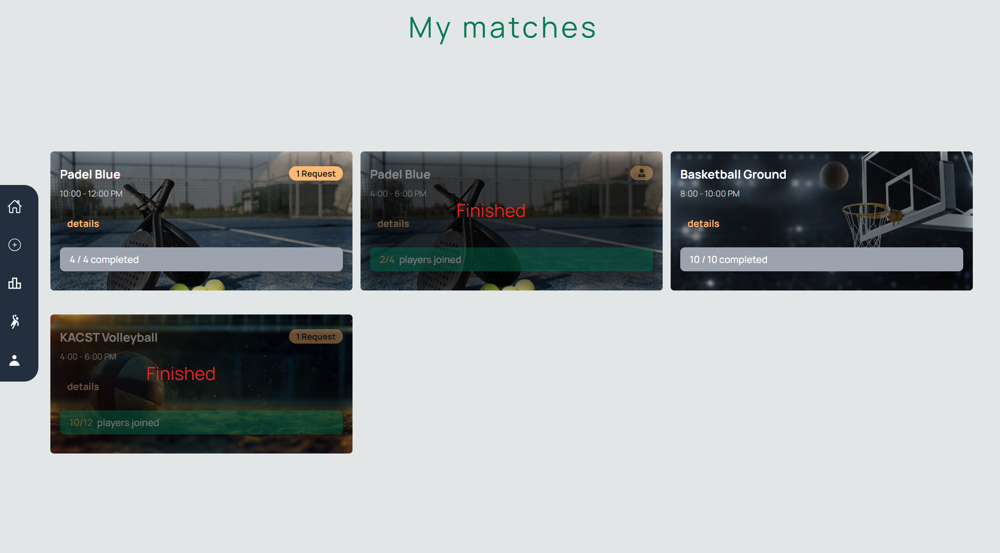

# TeamUp (Match Management Application)

## Description

This is a React-based application for managing sports matches, including Padel, Volleyball, and Basketball. The application allows users to view match details, manage team members, and accept or reject pending player requests. Fully integrated with Firebase.

## Features

- View match details
- Manage team members for different sports (Padel, Volleyball, Basketball)
- Accept or reject pending player requests
- Dynamic layout adjustments based on the sport category
- Point system and ranks
- Winning user friendly alert


## Try it now 
[TeamUp](https://team-up.netlify.app/)


## Installation

1. Clone the repository:
    ```bash
    git clone https://github.com/your-username/match-management-app.git
    cd match-management-app
    ```

2. Install the dependencies:
    ```bash
    npm install
    ```

3. Configure Firebase:
    - Add your Firebase configuration to `src/config/firebase.js`

4. Start the development server:
    ```bash
    npm run dev
    ```

## Usage

- Navigate to the home page to see the list of matches.
- Click on a match to view its details.
- If you are an admin, manage team members by accepting or rejecting pending player requests.
- Switch between different sports to see dynamic layout adjustments.

## Screenshots

1. 
2. 
3. 
4. 
5. 
6. 
7. 
8. 
9. 
10. 
11. 
12. 

## Contributors

- [@Alhaqbani21](https://github.com/Alhaqbani21)
- [@ammalgh](https://github.com/ammalgh)
- [@amwaj-a](https://github.com/amwaj-a)
